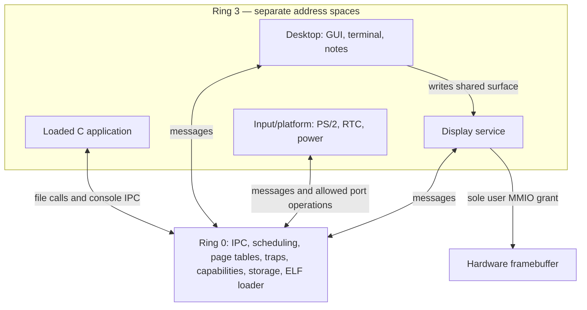

# Aurora microkernel architecture

## Execution boundary

The boot sector and BIOS loader are still Aurora's original assembly. The
loader reads four 120-sector chunks beginning at LBA 9 into physical `0x10000`,
copies the firmware font, selects VBE 1024x768x32 graphics, and enters long mode.
The first-stage loader and stage-two loader occupy LBA 0 and LBA 1–8.

The storage extension adds synchronous ATA PIO, AuroraFS, and a validated ELF
loader inside the kernel (`src/storage.h`). This is a compromise from a pure
microkernel; storage has not yet been moved to a user service. GUI and input/display
services retain their existing isolation.

The kernel installs its own GDT, TSS, IDT, and page tables. A TSS stack switch
and `iretq` provide ring transitions. Static services start at virtual `0x400000`;
applications start at their validated ELF entry point. Both use CS `0x23`,
SS `0x1b`, IF set, and IOPL zero. The TSS I/O-map offset is past
the descriptor limit, denying direct port instructions. Only `int 0x80` has a
user-callable IDT gate.

The native GCC environment additionally enables the x86-64 `syscall` instruction
and selects a limited Linux-ABI handler for native toolchain processes. Trap entry
switches to the desktop/kernel page-table root before C handlers access physical
memory aliases. Return restores the selected task's CR3, FS base, x87 state and SSE
state. The original services and SDK programs still use `int 0x80`.

The shared surface arrow represents a memory grant. Presentation messages and
acknowledgements still travel through the kernel.

## Source layout

| File | Role |
| --- | --- |
| `src/kernel.c` | Privileged mechanisms and fixed startup configuration |
| `src/traps.asm` | Exception/syscall stubs, register save/restore, GDT loading |
| `src/abi.h` | Shared syscall numbers and message format |
| `src/user/desktop.c` | Entire desktop and its built-in apps |
| `src/user/input.c` | PS/2 and RTC protocols, platform power requests |
| `src/user/display.c` | Hardware framebuffer copies |
| `src/user/lib.h`, `lib.c`, `start.asm` | Small freestanding user runtime |
| `src/user/probe.c` | Deliberately faulty processes, test build only |
| `src/user/linker.ld` | Page-aligned code/data boundaries |
| `src/storage.h` | ATA block I/O, AuroraFS, ELF validation and application creation |
| `sdk/` | Application startup, linker script, C runtime and headers |
| `apps/` | Separately compiled sample applications |
| `src/native.h` | Native static GCC/musl ELF loader and syscall compatibility |
| `src/native_fs.h` | Separate development-volume storage and pathname handling |

User services are separate ELF binaries, not privileged kernel modules. Their
flat images are embedded solely for boot transport and copied before starting
them. BIOS VBE initialization remains in the loader; the kernel grants the
resulting framebuffer mapping and passes a small bootstrap descriptor.

## Memory map

| Address | Use |
| --- | --- |
| `0x10000` onward | Kernel plus embedded boot images; supervisor-only |
| `0x70000` | Firmware font source, copied into desktop bootstrap data |
| Below `0x90000` | Early boot stack |
| `0x100000–0x1fffff` | Sixteen 64 KiB kernel stacks, each with a 4 KiB unmapped guard |
| Virtual `0x3f000000–0x3f0fffff` (RAM `0x4100000`) | Sixteen more guarded kernel stacks for task slots 16–31, mapped in every root |
| `0x200000 + PID * 0x10000` | Private page-table structures for the sixteen legacy slots |
| `0x4000000–0x407ffff` | Kernel task table, FPU state, native process/descriptor tables and the executable staging buffer, outside the kernel image and mapped only by the kernel root |
| Virtual `0x400000–0x5fffff` | Per-process private code, data, boot info, stack |
| Virtual `0x5d0000–0x5d1fff` | Read-only bootstrap descriptor and font |
| Virtual `0x5ef000–0x5effff` | Unmapped stack guard |
| Virtual `0x5f0000–0x5fffff` | 64 KiB user stack, writable/non-executable |
| Physical `0x2000000 + PID * 0x200000` | Backing RAM for the private region |
| `0x1000000–0x13fffff` | 4 MiB shared grant; first 3 MiB contain pixels |
| VBE framebuffer address | Display service's hardware mapping |

Code pages are user-readable/executable and not writable. Read-only data is
non-executable. Remaining private data and stacks are writable/non-executable.
NXE and CR0.WP are enabled. The kernel has supervisor identity mappings of the
first 4 GiB; user-accessible leaves exist only for private RAM and explicit
surface/framebuffer grants. The private physical aliases remain supervisor-only.
Framebuffer grants use 2 MiB page granularity, so they cover aligned MMIO pages.

Kernel mappings themselves are not hardened with separate RX/RW sections. The
OS retains fixed reservations for kernel/service structures. The BIOS loader
records E820 memory ranges; native processes allocate and reclaim usable
physical pages from 256 MiB through 1 GiB. Private anonymous memory (`mmap`,
`brk` and the process stack) is committed on first touch: a software page-table
bit marks the page as owed, the fault handler supplies a zeroed page, and a
request larger than free RAM is refused up front (heuristic overcommit). There
is no disk-backed paging.
The original SDK ABI has no allocation syscalls; native processes have bounded
`brk`/`mmap`/`mremap` backed by that physical allocator.
The supplied QEMU launch configuration is required.

## Scheduling and fault handling

PIT IRQ0 runs at approximately 100 Hz. A timer interrupt saves all general
registers, updates counters, and chooses the next runnable task in round-robin
order. Kernel code runs under the kernel root; the return path copies the chosen
task's saved frame onto that task's kernel stack, switches CR3 and restores it
with `iretq`. A process that does not yield still loses the CPU at the next
timer tick.

Syscalls execute with interrupts disabled and return to the caller unless it
yields, blocks, or exits. Each task has a guarded kernel stack. Explicit
continuations suspend disk callers and filesystem-lock waiters while other
ring-3 services run; IRQ handlers acknowledge completion and wake a waiter.
Filesystem mutation remains serialized. Native exit cleanup that may touch
storage is deferred out of interrupt dispatch. One to eight CPUs can execute
native applications and pthreads; services stay on the BSP. See
[SMP synchronization](SMP-DYNAMIC.md) for per-CPU state, locks and VM barriers.
Aurora's kernel and original SDK binaries use `-mgeneral-regs-only`.
The kernel also saves and restores x87/SSE state and FS/GS bases for native processes.
AVX state is not supported.

A user exception marks just that process dead, logs the fault, and schedules
another runnable process. Kernel exceptions halt with a serial diagnostic.
There is no service restart, receive timeout, or dependency recovery: losing
the display or input service can leave the UI waiting for its dependency, even
though the kernel and other runnable processes survive. If no runnable task
remains, the kernel halts with a diagnostic. The input service normally remains
runnable and yields between polling cycles.

## Syscalls

`int 0x80`: RAX is the syscall number; RDI, RSI, RDX are arguments. RAX holds a
signed result; all other general registers are preserved. See `src/abi.h`.

| Number | Name | Arguments / result |
| --- | --- | --- |
| 0 | YIELD | Choose another runnable process |
| 1 | SEND | Destination PID, message pointer; copies one message |
| 2 | RECV | Writable message pointer; blocks when empty |
| 3 | POLL | Writable message pointer; returns EMPTY when empty |
| 4 | IN | Port; returns one byte if the caller holds permission |
| 5 | OUT | Port, value, width (1 or 2); requires permission |
| 6 | LOG | Pointer, length (1–160); writes boot/debug serial output |
| 7 | TICKS | Returns the timer tick count |
| 8 | EXIT | Mark the calling process dead and schedule another |
| 9 | FILE_READ | FileRequest pointer; read up to capacity, return byte count |
| 10 | FILE_WRITE | FileRequest pointer; create/replace whole file, return byte count |
| 11 | FILE_LIST | Directory slot (0-31), writable FileEntry pointer |
| 12 | SPAWN | SpawnRequest pointer; desktop-only, returns application PID |
| 13 | STATUS | Application PID, writable signed exit-code pointer; desktop-only; returns 1 when dead, 0 otherwise |
| 14 | NATIVE_SPAWN | SpawnRequest pointer; desktop-only; start a tool from the development volume |
| 15 | NATIVE_READ | FileRequest pointer; desktop-only; read a development `/work` file |
| 16 | NATIVE_WRITE | FileRequest pointer; desktop-only; replace a development `/work` file |
| 17 | NATIVE_LIST | Work-file ordinal, writable FileEntry pointer; desktop-only |

Errors: `-1` capability denied, `-2` invalid pointer/length, `-3` queue full,
`-4` destination dead, `-5` unknown syscall, `-6` no pending message,
`-7` file not found, `-8` disk I/O or unavailable filesystem, `-9` invalid ELF,
`-10` resource/size limit, `-11` invalid filename.

Buffer validation checks arithmetic bounds and every touched page, including
write permission for receive buffers. Only private user memory is accepted for
IPC and logging. This prevents kernel pointers, guard pages, read-only code,
and ranges crossing the private-memory boundary from being used as writable
receive buffers. Sending to an unauthorized endpoint is rejected first.

## IPC and capabilities

Messages contain five 64-bit fields: `sender`, `type`, `a`, `b`, `c`. Each task
has a 32-message queue in kernel memory. The kernel always replaces `sender`
with the actual caller's PID. If the recipient is waiting, the kernel copies
directly into its previously validated receive buffer and makes it runnable.
Otherwise it enqueues the copy. Sending never blocks; a full queue returns
`ERR_FULL`, allowing a user service to yield and retry.

Fixed endpoint grants:

- Desktop (PID 0) → input (PID 1), display (PID 2).
- Input and display → desktop.
- Test probes → no send endpoints.
- Loaded applications → desktop (console output).

The input/platform process alone has 8-bit access to ports `0x60`, `0x64`,
`0x70`, `0x71`, and 16-bit writes to QEMU's `0x604` power port. The kernel
contains the permission check and elementary I/O instruction; device protocol
logic remains in the user service. Serial output is a bounded diagnostic
syscall, not an exposed serial-port grant.

These capabilities are static allowlists, not dynamically transferable handles.
Application slots are 3–15 normally and 10–15 in the self-test image; slots
3–9 remain reserved for deliberate probes in that image. All unused slots start
dead. The shell launches one application at a time and reports its exit status.
Application faults terminate the process with status `-128 - vector`; dead slots
are reusable. New application page tables omit unused pages and retain the
existing protected stack/bootstrap layout. ELF load segments supply RX/R/NX/RW
permissions and zero-initialized BSS. Arguments are copied to read-only virtual
address `0x5d1100` and parsed by the application startup runtime.

Application console messages contain up to 23 non-NUL bytes in the payload plus
a terminator. The runtime retries a full IPC queue and the desktop wraps received
text into terminal lines. Native applications additionally use a TTY input
queue fed by the desktop, with canonical input, echo and basic control keys.

The platform service is trusted to use its hardware permissions correctly.

## AuroraFS storage

The primary ATA master is the 16 MiB boot image. LBA 512 contains the versioned
`AURFS01` magic. LBAs 513–516 contain 32 fixed 64-byte directory records
(`name[32]`, 32-bit size, 32-bit used flag, 24 reserved bytes). File slot N owns
128 sectors starting at LBA `520 + N * 128`, so files are limited to 64 KiB and
cannot fragment. Metadata is validated at mount; an invalid/unavailable volume
causes filesystem calls to fail instead of auto-formatting it.

Before scheduling starts, disk operations use bounded PIO polling. Afterwards
the primary channel is interrupt-driven: IRQ14 completes reads, writes and
flushes while the caller sleeps under the filesystem mutex, a sequence number
tags each command so a late interrupt cannot complete a newer one, and a tick
deadline bounds every wait. Writes flush file data before updating/flushing
metadata. They are not journaled or atomic across power loss.
There are no directories, deletion, rename, per-file permissions or descriptors.
All processes have shared filesystem access through validated whole-file APIs.
The application runtime supplies a fixed 128 KiB allocator, not kernel demand
paging or a growable heap. See `sdk/README.md` for the executable/runtime contract.

## Desktop protocol

- Input sends keyboard scan codes, complete three-byte mouse packets, and RTC
  updates to the desktop as messages.
- The desktop writes its shared pixel surface, sends `PRESENT(sequence)` to
  display, and waits for `PRESENTED(sequence)` before writing the surface again.
- While waiting for presentation, the desktop receives input messages and
  retains its dirty flag for a later redraw.
- Display copies the surface into its granted framebuffer and acknowledges.
- Reboot/shutdown commands send `POWER` to the input/platform service.

The terminal, notes, and settings currently share one desktop process. They
are user-space apps, but are not mutually isolated from one another.

## Verification

The native development environment uses 1 GiB QEMU RAM and a GPT VirtIO disk
(or the original ATA toolchain disk). The kernel has 32 task slots: the three
services, 13 legacy application slots and 16 further slots that only native
processes use. Native virtual ranges are `0x400000–0x203fffff`, backed by
individually allocated E820 physical pages. Native page-table roots are at
`0x06400000` in 1088 KiB strides, alias page tables at `0x04400000` in 1 MiB
strides, and development-volume metadata at `0x0d100000` (16,384 cached
filesystem entries, 8 MiB). Supervisor aliases above 4 GiB expose each native
address space to the kernel without requiring contiguous physical allocation.
VirtIO block requests use a 16 KiB ring and eight 64 KiB bounce slots at
`0x0d000000`; one submission carries up to eight in-flight chains.
Exec staging uses a 1 MiB string pool at `0x0c400000`, environment storage at
`0x0c500000`, and argument-pointer tables at `0x0c600000` and `0x0c610000`.
The native state lock protects these shared staging buffers. Up to 4,096
arguments are accepted; exceeding the count or byte bounds returns `E2BIG`
before replacing the old image.
The final 2 MiB of each native range is a stack with an unmapped guard below it.
Native process memory and the development metadata are touched only when the
optional disk is present. Use the supplied launcher so that the memory size and
disk configuration match. See [Native GCC guide](NATIVE-GCC.md) for supported
syscalls and the distinction between the two app ABIs. See
[Development foundations](FOUNDATIONS.md) for the current filesystem, GNU
bootstrap, memory and signal support and its remaining limitations.

The native compiler suite verifies GCC/cc1/as/collect2/ld running in Aurora,
generated executables, integer and floating-point results, error recovery, and
compiled-program persistence across VM restart. It invokes no host C compiler.

The normal image passes the GUI regression suite. A separate self-test image
adds seven probe tasks: six deliberately fault and one validates syscall errors
then spins without yielding. The tests inspect real page tables and counters
through QMP, verify the expected CPU faults, confirm preemption, and exercise
the GUI while the spinning task remains alive. Generated logs/screenshots and
JSON results are retained in `build/` and `build/selftest/`.

Reference for CPU mechanisms: [Intel 64 system programming manuals](https://www.intel.com/content/www/us/en/developer/articles/technical/intel-sdm.html).

See [Thread and IRQ validation](THREADS.md) for shared address-space ownership,
copy-on-write, futex waits, bounded IRQ completion and current limitations.
